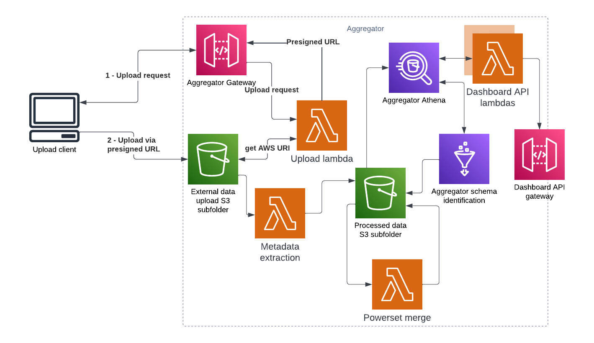

# Aggregator architecture

## Terminology

The aggregator uses the following terms as context signifiers:

- **ETL** in this context refers to the [Cumulus ETL](https://github.com/smart-on-fhir/cumulus-etl), which extracts data from an EHR system
- **Library** in this context refers to the [Cumulus Library](https://github.com/smart-on-fhir/library), which allows an SME to design queries against the outputs of the ETL to generate datasets
- **Site** is shorthand for any Cumulus participant that is uploading data to the aggregator. They will be running queries from the library against their own EHR system
- **Study** is the name for any research grant topic being addressed in Cumulus, such as Covid or Lyme
- **Data package** is the name for a file created by Library query as part of a study that is uploaded to the aggregator, and is focused on a single topic within that study. A study may have many data packages. They are expected to be in paquet format.
- **Aggregates** are combinations of similar data packages, from the same study, from as many sites as have uploaded that type of data package. 
- **Subscriptions** are aggregates that have been processed by AWS Glue and are available as Athena tables, and thus are available to be used by the dashboard for generating charts

## System Diagram

## Functional overview

The cumulus aggregator provides two APIs around a series of data manipulations in Amazon S3/Athena:
- The site facing API allows users to upload library powerset data to an S3 bucket
- The dashboard API provides data for ingestion to the dashboard web application

Internal to the aggregator, the following actions are performed
- Study data from different sites are merged to produce a series of aggregate data counts
- Athena tables are created for querying these merged datasets

## Site API details

The site API gateway has a single public endpoint, which authorizes a request via a unique site ID over https. When authorization passes, it generates a signed URL for the aggregator upload bucket for the file being requested to be uploaded using native S3 features.

Once a file has been successfully uploaded, an S3 event is emitted, kicking off data aggregation.

### Data processing

All data files are logically grouped by site, study, and data package. Data moves incoming files through several stages of a state machine, using S3 locations for persistence in each stage:

- `site_upload` contains files in the state they were provided from the providing site.
- If a file in `site_upload` is a valid file, it is moved to `latest` for joining as part of an aggregate. Otherwise, it is moved to `error`.
- A file in `latest` will be joined with other previously aggregated files, contained in `last_valid`. If it successful, it replaces a matching file for the site/study/data package in `last_valid`. If not, it is moved to `error`.
- A file in `last_valid` will be used for aggregation within a site/study/data package for uploads from other locations, up until it is replaced by a more recent, successfully aggregated file for that site/study/data package, at which point it will be moved to `archive` with a timestamp of when the move occured.
- Files in `aggregates` and `csv_aggregates` are created after aggregation is completed. The former (in parquet) is used as the data Athena queries, while the latter is mostly used in case a user wants a human-readable version of the same data.
- Files in `error` are timestamped with the time they were moved into the error state. Corresponding logs for the error can be found in CloudWatch

Files in any of these locations can be viewed by a user who has appropriate S3 access permissions within the AWS account the data is deployed to. This may be useful to access for loading aggregates into a non-dashboard analytic environment.

A Glue job will run once weekly to detect any completely new subscriptions and generate Athena tables for accessing them, after which point they are available as subscriptions.

### Dashboard API

The dashboard API gateway provides a set of endpoints aimed at servicing the Cumulus dashboard, though they could also be used to provide data to another application. It has endpoints to provide the following kinds of data:

- Metadata, exposing which sites have uploaded what study's data packages, and when the last time was it traversed through a relevant state in the data processing pipeline
- Subscriptions, exposing which aggregates have been crawled by glue and are ready to be queried
- Chart data, which allows for passing psuedo query parameters to extract subsets of an aggregate associated with a subscription for graphing in Cumulus.